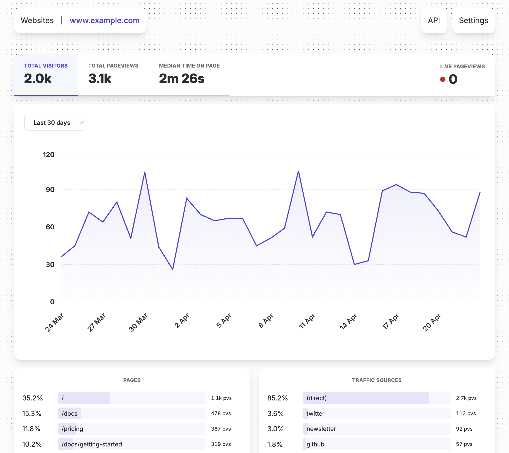

# Visage: Simple Privacy-Friendly Web Analytics for Self-Hosters



## Summary

Visage is a simple, privacy-friendly web analytics solution for self-hosters.

It helps you understand how many visitors your websites are getting, where they come from and what they're looking at, without tracking individuals, setting cookies or storing personal data. As such, Visage is compliant with privacy policies like the GDPR, and doesn't require a cookie banner.

Drop a tiny tracking snippet into your websites and get a dashboard with:

* Total visitors, pageviews and median time on page
* Live pageviews
* Time-series charts over custom date ranges
* Top pages and traffic sources
* Per-website API access

## Quickstart

```sh
# Clone the source code
git clone https://github.com/butterhosting/visage.git
cd visage

# Create a docker image
./visage image create

# Run the container
docker run --rm -p 3000:3000 visage:latest
```

## Documentation

Please visit [www.butterhost.ing/visage](https://www.butterhost.ing/visage) for the full documentation, covering deployment, configuring websites, using the API, tips, tricks and more.
